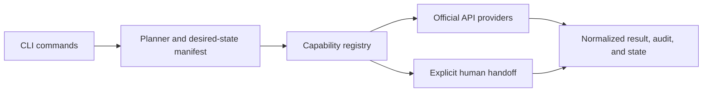

# App Store Connect CLI 4.9.0 audit and Gplay roadmap

Date: 2026-08-23
Gplay baseline: `v0.8.1`, commit `3d4cea4245a33e814f440fe9e99bc6325e072611`
ASC baseline: `4.9.0`, commit `563ee9e0ba2652348a8defdd71ccb454c3aa7b60`

## Executive conclusion

The best feature to take from ASC is not a larger command count. It is the explicit separation between supported public-API workflows, unsupported workflows, and manual fallbacks.

After the initial audit, the project adopted a stricter account-safety constraint: Gplay will not implement private Play Console RPCs, retain browser cookies, drive authenticated Console forms, or automate legal acceptance. Unsupported setup remains an explicit manual handoff. This supersedes the original experimental-browser recommendation while preserving the useful capability-registry and planning architecture.

The first end-user workflow should be `gplay bootstrap plan`, covering:

1. Create the Play Console app record.
2. Upload the first AAB/APK through Play Console.
3. Configure standard Play App Signing.
4. Complete or hand off required setup and legal declarations.
5. Return to the official API path as soon as the app becomes eligible for it.

This is not speculative. Google's Edits guide says the publishing API can only modify an app after at least one APK has been uploaded through Play Console, and cannot complete publishing legal consents or change an app from published to unpublished. [Google Edits guide](https://developers.google.com/android-publisher/edits)

## Scope and method

- Audited the exact latest ASC release at the time of research: [`4.9.0`](https://github.com/rorkai/App-Store-Connect-CLI/releases/tag/4.9.0), published on 2026-08-23. Its tag resolves to [`563ee9e0`](https://github.com/rorkai/App-Store-Connect-CLI/commit/563ee9e0ba2652348a8defdd71ccb454c3aa7b60).
- Cloned and built that tag, traversed its live help tree, inspected its public API client, private web client, command registry, tests, and CI.
- Inspected the current local Gplay `main`; `git ls-remote` confirmed it matches the remote `main` commit and [`v0.8.1`](https://github.com/tamtom/play-console-cli/releases/tag/v0.8.1) is its latest release.
- Ran Gplay's complete unit test suite with a coverage profile using its required Go 1.25.8 toolchain.
- Compared Gplay's checked-in Android Publisher endpoint snapshot with the live official discovery document and reviewed official Play Console documentation for workflows absent from the public API.

Repository metrics are measurements from the two exact source trees, not marketing claims.

## Scale and test snapshot

| Metric | ASC 4.9.0 | Gplay 0.8.1 |
|---|---:|---:|
| Top-level commands | 81 | 54 |
| Full command-path nodes | 1,843 | 322 generated reference entries |
| Go packages | 120 | 91 |
| Production Go lines | 350,860 | 37,136 |
| Test Go lines | 415,079 | 27,810 |
| `_test.go` files | 1,178 | 152 |
| `Test*` functions | 9,941 | 1,447 |
| Web-layer `Test*` functions | 672 | 16 |
| Measured statement coverage | No enforced/published aggregate found | 48.5% locally |

ASC is roughly an order of magnitude larger. That is evidence of breadth, not an architecture goal for Gplay.

## ASC feature surface

ASC registers 81 top-level families and 1,843 command paths. The authoritative family taxonomy is in its generated [command reference](https://github.com/rorkai/App-Store-Connect-CLI/blob/563ee9e0ba2652348a8defdd71ccb454c3aa7b60/docs/COMMANDS.md).

Major families include:

- App lifecycle: apps, app setup, versions, metadata, localizations, screenshots, video previews, product pages and experiments, app events, pricing, pre-orders, categories, age ratings, accessibility, encryption, agreements, and EULA.
- Release: build upload and waiting, TestFlight groups/testers/feedback/crashes, high-level publish, release staging, validation, review, submission, and release status.
- Monetization: IAP, subscriptions, pricing, territories, introductory/promotional/offer-code/win-back offers, StoreKit server APIs, review assets, and submission.
- Signing and local tooling: bundle IDs, capabilities, certificates, profiles, devices, merchant/pass IDs, Xcode archive/export, distribution, notarization, and Xcode Cloud.
- Analytics and growth: analytics, finance, performance, Apple Ads, optimization, weekly/daily insights, rankings, and keyword tooling.
- Agent and operations: workflows, diff, capabilities, schema, search, embedded docs, install-skills, system status, notifications, telemetry, and shell completion.

Release 4.9.0 added offline metadata-rejection validation, availability guards, app/version resolution, TestFlight waiting and export filters, keyword discovery/scoring, a September 2026 age-rating audit, web agreement status/acceptance, and subscription-price derivation. [4.9.0 release notes](https://github.com/rorkai/App-Store-Connect-CLI/releases/tag/4.9.0)

### Features Gplay already matches or exceeds

Gplay is not a small release uploader. It already has strong equivalents for:

- High-level and low-level publishing, staged rollout, promotion, status, validation, and resumable workflows.
- Metadata, localization, images, screenshots, Fastlane migration, and release notes.
- Subscriptions, base plans, offers, one-time products, purchase verification, refunds, orders, RTDN, and external transactions.
- Vitals, crashes, ANRs, performance, reviews, finance/statistics reports, and notifications.
- Users, grants, testing tracks, testers, internal sharing, Play Games, device tiers, generated/system APKs, and app recovery.
- Offline preflight scanning. Gplay's AAB/APK manifest, secrets, SDK, billing, size, alignment, and policy checks are a genuine differentiator.
- Audit logging, quota inspection, global dry-run interception, JSON-first output, JUnit reporting, and scheduled live integration tests.

## ASC architecture assessment

ASC's main architectural layers are:

- `internal/cli/*`: command packages grouped by domain.
- `internal/asc`: a large typed client for the public App Store Connect API.
- `internal/web`: Apple Account authentication, cached sessions, throttling, and private web endpoints.
- `internal/workflow`, `internal/validation`, `internal/distribution`, `internal/xcode`, and related deep modules for orchestration.
- A lazy root command catalog that exposes lightweight metadata and materializes only the selected command. [ASC registry](https://github.com/rorkai/App-Store-Connect-CLI/blob/563ee9e0ba2652348a8defdd71ccb454c3aa7b60/internal/cli/registry/registry.go)

The lazy catalog is worth adopting before Gplay grows substantially. It gives command search, docs, and completion a shared metadata source without eagerly building a huge mutable `ffcli` tree.

ASC centralizes public client construction behind shared factories and supports custom HTTP clients for tests. It still uses global factory hooks in places, so it is not a pure dependency-injected architecture, but client acquisition is considerably more centralized than Gplay's current pattern.

### What `asc web` actually does

`asc web` is not browser or DOM automation. It performs authenticated HTTP calls to Apple's unofficial private App Store Connect endpoints using an `http.Client` and cookie jar. Its auth client implements Apple Account SRP login, 2FA continuation, and team/provider selection. [ASC web auth source](https://github.com/rorkai/App-Store-Connect-CLI/blob/563ee9e0ba2652348a8defdd71ccb454c3aa7b60/internal/web/auth.go)

Its 13 web families cover auth, agreements, API keys, sandbox testers, app creation/deletion/availability, compatibility, medical-device declarations, removed apps, bundle-ID capabilities, app groups, privacy, review/rejection details, subscription-only gaps, analytics dashboards, and Xcode Cloud. [ASC web registry](https://github.com/rorkai/App-Store-Connect-CLI/blob/563ee9e0ba2652348a8defdd71ccb454c3aa7b60/internal/cli/web/web.go)

Useful safety patterns include:

- A separate experimental namespace and explicit warnings that private contracts can break.
- Session lifecycle commands and selectable cache backends.
- Request throttling: one second by default, never below 200 ms.
- Redacted debug logs and errors that do not dump sensitive response bodies.
- Plan/apply/publish separation for privacy changes.
- `--confirm` on destructive or legal actions.
- Idempotent operations where possible.
- File permissions and no-overwrite behavior for one-time credentials.

## Gplay architecture assessment

### Strengths

- A small, static Go binary with only six direct dependencies and official generated Google clients.
- Clear domain-per-command packages and a simple root registry.
- Good shared behavior for timeouts, retries, output, dry-run, errors, and config.
- Separate clients for Android Publisher, Reporting, Checks, Games, Managed Play, and GCS.
- Strong local workflow, validation, preflight, audit, and output modules.
- A central runtime abstraction has begun to emerge.

### Constraints to address before adding a large web surface

1. **Dependency injection is only partially migrated.** `internal/cli/runtime` owns a Play service factory, but only the apps family receives it. Forty CLI packages still call `playclient.NewService` directly. This makes command testing and provider substitution harder.
2. **The root catalog is eager and only contains command constructors.** It lacks capability, stability, provider, API-resource, and search metadata.
3. **Command handlers combine flags, auth, API calls, orchestration, and output.** A browser implementation added directly to `internal/cli/web` would deepen this coupling.
4. **I/O is globally coupled.** There are hundreds of direct `os.Stdout`, `os.Stderr`, and `fmt.Print*` references in command code.
5. **Current `gplay web` is only a URL launcher.** It hard-codes eight Console URLs and invokes the OS browser opener. It has no session, inspection, plan, mutation, or browser driver.
6. **API coverage claims are stale.** The checked-in endpoint index has 136 entries; the live discovery document had 145 at audit time. New resources include app-signing APIs, chargeback refund review, release listing, and APIs for registered third-party app stores. The repository's API notes still say they were last verified in February 2026.
7. **The README overstates browser replacement.** It says Gplay completely replaces Play Console, but official Google documentation requires Console use for first upload, legal consents, and published/unpublished state.

## Testing comparison

### ASC

ASC has exceptional raw test breadth: more test code than production code, 9,941 test functions, 2,965 command black-box test functions, and 672 tests in its web CLI/core. Its latest release commit had green package, web, command, macOS/Linux/Windows build, lint, docs, CodeQL, and vulnerability checks.

CI shards the web and CLI suites, type-checks platform-gated code, validates workflow contracts and generated docs, and tests release packaging. [ASC PR workflow](https://github.com/rorkai/App-Store-Connect-CLI/blob/563ee9e0ba2652348a8defdd71ccb454c3aa7b60/.github/workflows/pr-checks.yml)

Weaknesses: no aggregate coverage gate was found; regular CI does not run the race detector; and live integration is manually dispatched rather than scheduled. [ASC integration workflow](https://github.com/rorkai/App-Store-Connect-CLI/blob/563ee9e0ba2652348a8defdd71ccb454c3aa7b60/.github/workflows/integration.yml)

### Gplay

Gplay's complete suite passes and measures 48.5% statement coverage. There are 1,447 test functions, 86 black-box command tests, help-contract tests, `httptest` API mocking, and 15 integration test functions. Coverage is uneven: 23 packages have no package-local tests, including the core API clients and several CLI families.

Gplay CI has several advantages worth preserving:

- The race detector runs on PR and main tests.
- Coverage is uploaded on main.
- Live integration tests, including explicitly enabled mutations, run weekly against a dedicated app.
- CodeQL and `govulncheck` run on schedules.
- Generated docs, formatting, lint, and multi-platform release builds are checked.

The testing strategy is solid; the priority is better seams and critical-flow coverage, not matching ASC's line count.

## Why a manual Play Console handoff is necessary

Google's public API boundary leaves material gaps:

- App creation is documented as a Play Console workflow. [Create and set up an app](https://support.google.com/googleplay/android-developer/answer/9859152)
- The Edits API requires an existing app with at least one APK uploaded through Console and excludes legal consents and published/unpublished state. [Edits guide](https://developers.google.com/android-publisher/edits)
- A first release requires standard Play App Signing configuration in Console. [Prepare and roll out a release](https://support.google.com/googleplay/android-developer/answer/9859348)
- The new app-signing API is only for enterprise self-hosted Cloud KMS keys; Google explicitly says standard enrollment with Google-generated or Google-managed keys cannot be done through that API. [appsigning.enrollApp](https://developers.google.com/android-publisher/api-ref/rest/v3/appsigning/enrollApp)
- Required app-content workflows include privacy policy, ads, reviewer access, target audience, high-risk permission declarations, content ratings, and other policy declarations. Most do not exist in the Android Publisher resource tree. [Prepare an app for review](https://support.google.com/googleplay/android-developer/answer/9859455), [API reference](https://developers.google.com/android-publisher/api-ref/rest)
- Content ratings require the IARC questionnaire in Play Console. [Content-rating requirements](https://support.google.com/googleplay/android-developer/answer/9859655)

Other useful Console-only or API-incomplete surfaces include custom store listings, store-listing experiments, promotional content, deep-link patches and diagnostics, managed publishing, app unpublish/republish, pre-registration, publishing overview/review issues, policy status, pre-launch reports, and account/agreement state. [Custom store listings](https://support.google.com/googleplay/android-developer/answer/9867158), [store-listing experiments](https://support.google.com/googleplay/android-developer/answer/12053285), [promotional content](https://support.google.com/googleplay/android-developer/answer/12929029), [deep links](https://support.google.com/googleplay/android-developer/answer/12463044)

## Recommended policy-safe architecture



Suggested packages:

```text
internal/capability       workflow/provider/stability metadata
internal/runtime          clients, IO, clock, and audit dependencies
internal/bootstrap        deterministic initial-app manual-handoff plans
internal/plan             immutable plans and hashes for supported mutations
internal/cli/bootstrap    flags and rendering only
```

Provider selection should be explicit and inspectable:

- `official-api`: stable default.
- `manual`: command returns the exact Console destination and remaining action.
- `unsupported`: no implementation because no documented API exists or the risk is unacceptable.

Never silently fall back from an official API to a Console mutation. Gplay may open a documented Console URL, but the account owner performs and verifies the action.

### Why authenticated browser automation is excluded

ASC's direct private endpoint approach works because it implemented Apple's SRP/2FA web auth protocol. Recreating Google Account authentication and retaining Google cookies in a CLI is a materially different security and account-risk proposition.

Even headed automation can submit under the wrong account, operate against changing private UI contracts, retain a remotely controllable authenticated profile, or accept declarations whose current text the CLI cannot safely interpret. The policy-safe design therefore stops at a deterministic plan and visible manual handoff.

## Prioritized implementation roadmap

### P0: foundation and truthfulness

1. Add `gplay capabilities` with `official`, `manual`, and `unsupported` statuses; include command, provider, API resource, stability, notes, and next action in JSON.
2. Add local `gplay search` over command paths, examples, capabilities, and canonical intents.
3. Add `gplay schema` over the embedded Google discovery documents.
4. Turn the root registry into a lazy metadata catalog before adding more families.
5. Finish runtime injection across command packages; inject IO, client factories, clock, and audit sink.
6. Update the API discovery snapshot and add CI drift detection rather than relying on a manual `make update-api-spec`.
7. Correct README claims and label the current `web open` behavior accurately.

### P0: offline bootstrap planner

1. `gplay bootstrap plan`: validate the package name and local AAB, then emit a deterministic plan.
2. Run `gplay preflight` locally before any Console work.
3. Hand off app creation, first upload, standard Play App Signing, and required declarations to the account owner.
4. Return to `gplay publish track` and other documented API commands for later releases.
5. Keep the planner non-executing: it never authenticates, uploads, submits, or accepts agreements.

Example desired-state file:

```yaml
app:
  name: Example App
  default_language: en-US
  type: app
  pricing: free
  contact_email: support@example.com
release:
  artifact: app-release.aab
  track: internal
  signing: google-managed
```

The package name and version should be derived and verified from the artifact, not duplicated by default.

### P1: release readiness and app content guidance

- Offline checklists to inventory required declarations and unresolved tasks without scraping Console state.
- Ads, app access/reviewer credentials, target audience, content rating, news/health/financial/permissions declarations, and policy-specific forms.
- Category/tags and initial availability.
- Publishing overview, review issues/messages, policy status, pre-launch reports, managed publishing, and unpublish/republish.
- Keep Data Safety on the official `applications.dataSafety` API and expose that distinction through capabilities.

### P1: ASC-inspired non-web features

- Generic remote/local `plan`, `approve`, `apply`, and resume semantics across metadata, images, monetization, and releases.
- Built-in pinned `install-skills` with checksum/commit verification and rollback.
- Consolidated weekly/daily `insights` from vitals, reviews, acquisition, finance, and release data.
- First-class API drift tooling and unsupported-endpoint reporting.
- Implement current official gaps: true `orders.batchget`, `orders.reviewrefund`, and enterprise Cloud KMS app-signing commands when the generated Google client supports the new resource.

### P2: growth and local Android toolchain

- Custom store listings and groups.
- Store-listing experiments with plan/status/results/apply-winner flows.
- Promotional content and pre-registration.
- Deep-link patching/verification and Play Integrity/automatic-protection configuration.
- Acquisition/retention/cohort dashboards that are not available from stable report APIs.
- Optional Gradle build/sign/package helpers and screenshot capture/framing, analogous to ASC's Xcode and screenshot pipeline, without making Gradle a requirement for normal Gplay commands.

## Bootstrap testing strategy

1. **Pure unit tests:** local input validation, artifact hashing, plan hashing, provider classification, and stable step ordering.
2. **CLI contract tests:** JSON/table/markdown output, required flags, invalid files, and explicit safety fields.
3. **No live bootstrap tests:** do not log into Play Console or exercise a personal or production account.
4. **Official API integration tests:** where separately enabled, use only dedicated test resources and documented APIs; they are outside the bootstrap planner.

## What not to copy from ASC

- Do not chase ASC's 1,843-command breadth or bespoke type volume. Keep official generated Google clients.
- Do not change Gplay's JSON-first default to TTY-dependent output; deterministic JSON is part of Gplay's agent contract.
- Do not store Google passwords or implement Google Account login in the CLI.
- Do not call private Play Console endpoints or drive authenticated Console forms.
- Do not retain or import Google browser cookies.
- Do not automate agreement acceptance as the first feature.
- Do not make Node, Python, a JVM, or a bundled browser mandatory for API-only use.
- Do not add telemetry merely for parity.

## Recommended first delivery slice

The highest-value, coherent first slice is:

1. Capability registry plus accurate documentation.
2. Deterministic `gplay bootstrap plan` output with local AAB verification.
3. Manual app creation, first AAB upload, Play App Signing, and legal-declaration handoffs.
4. A documented return to official API commands immediately afterward.
5. Unit and CLI contract tests that make no Google requests.

That slice makes the hard API boundary explicit while preserving Gplay's strongest qualities: official API first, explicit flags, JSON output, dry-run safety, and a lightweight single binary.
